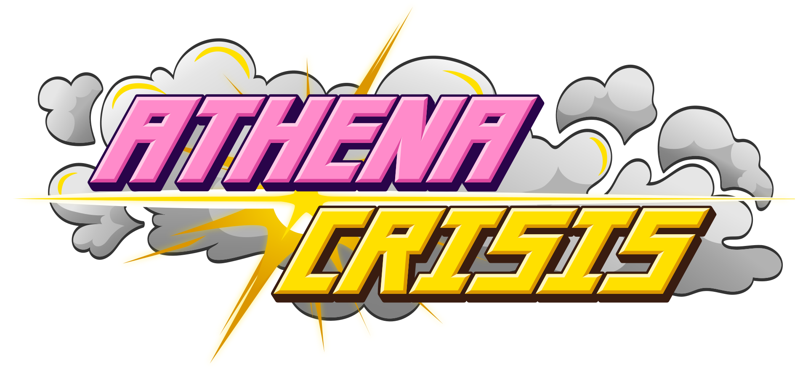
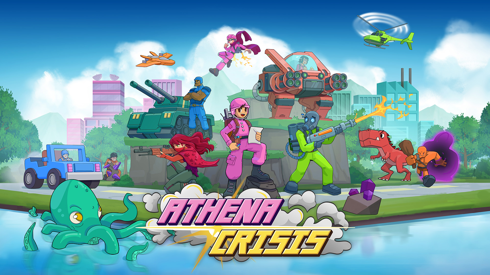

# Athena Crisis

<p align="center">
  <a href="https://athenacrisis.com">
    
  </a>
</p>

[Athena Crisis](https://athenacrisis.com) is an Open Core video game developed by [Nakazawa Tech](https://nkzw.tech) and published by [Null](https://null.com). The source code in this repository is licensed under the [MIT License](./LICENSE.md) and can be used to improve Athena Crisis, build additional tools, study game development with JavaScript or create entirely new turn-based strategy games.

The single-player campaign, multiplayer, art, music, and content are not open source. You can try a demo at [athenacrisis.com](https://athenacrisis.com) and you can [wishlist or purchase Athena Crisis on Steam Early Access](https://store.steampowered.com/app/2456430/Athena_Crisis/) or [buy Athena Crisis directly](https://app.athenacrisis.com/checkout) to play the full game.

If you like Athena Crisis, [please consider a sponsorship to support its development](https://github.com/sponsors/cpojer).

<a href="https://athenacrisis.com">
  
</a>

## Setup

Athena Crisis requires [Node.js](https://nodejs.org/en/download/package-manager) and the latest major version of [`pnpm`](https://pnpm.io/installation).

> [!NOTE]
>
> <details><summary>Windows Specific Config</summary>
> Developers on Windows will want to ensure that they are using `bash` to run `package.json` scripts. You can configure npm to use git bash by default with the following:
>
> ```bash
> npm config set script-shell "C:\\Program Files\\git\\bin\\bash.exe"
> ```
>
> </details>

```bash
pnpm install && pnpm dev:setup
pnpm dev
```

Visit [localhost:3003](http://localhost:3003/) to see the docs page.

## Packages

The codebase is split into multiple packages to enforce the separation of concerns. We suggest starting with these packages to get an end-to-end overview:

- `athena` → Data structures and algorithms for manipulating _map_ state (_client/server_).
- `apollo` → Data structures and algorithms for manipulating _game_ state (_client/server_).
- `hera` → Game engine and rendering (_client_).
- `ui` → Design system (_client_).
- `docs` → Docs & Playground (_client_).

These are secondary packages focused on specific domains:

- `art` → Handling of assets (_client/build_).
- `codegen` → Run `pnpm codegen` when changing game `Action`s or `ActionResponse`s to generate encoded actions and formatters (_build_).
- `dionysus` → AI code (_client/server_).
- `hephaestus` → Iterator and Immutable data structures (_client/server_).
- `hermes` → Campaign related data structures and algorithms (_client/server_).
- `i18n` → Internationalization (_client/build_).
- `offline` → Offline splash screen for app (_client_).
- `tests` → e2e tests.

## Documentation & Playground

Check out our [Athena Crisis Open Source Docs & Playground](https://athenacrisis.com/open-source) site.

# Q&A

## What is open source and what isn't?

About 75% of all non-content related Athena Crisis code – **almost 100,000 lines** – is open source, including the core data structures, algorithms, game engine, rendering, AI, and the map editor. Backend implementations such as user management, databases, APIs, realtime spectating, server configuration, and app wrappers for Steam or app stores are not open source. We aim to open source more of the game over time, but the content will remain the intellectual property of Nakazawa Tech KK and therefore not be open source. You can buy and enjoy [Athena Crisis on Steam Early Access](https://store.steampowered.com/app/2456430/Athena_Crisis/) or [buy it on athenacrisis.com](https://app.athenacrisis.com/checkout).

## Why did you open source Athena Crisis?

[Nakazawa Tech](https://nkzw.tech) is an Open Core company. See [the "Athena Crisis is now Open Source" blog post](https://cpojer.net/posts/athena-crisis-open-source) for more information.

## How is this codebase used at Nakazawa Tech?

We use a monorepo for Athena Crisis at Nakazawa Tech and are syncing a portion of the codebase to this repository. Code merged into this open-source repository is automatically synced to the internal monorepo, and vice versa. Athena Crisis always runs the latest version of code from this repository in production.

### Why are some folders almost empty?

To simplify dependency management with [`pnpm`](https://pnpm.io/), most of the internal `package.json` files and the `pnpm-lock.yaml` are public. This makes it easier to share code between the internal monorepo and this repository but leaves some placeholders in this repository, most notably the `ares` and `artemis` packages, which can be ignored.

## Why are packages named after Greek gods?

Why not!? At some point it became necessary to split the codebase into multiple packages to share code between the client and server. The first package was named `athena`, and it was hard to come up with meaningful names for the other packages. We decided to name them after Greek gods because it seemed cute.

Over time, many pieces are expected to be extracted into separate packages and published on npm under the `@nkzw` organization. Please send a Pull Request if you find code that you think should be extracted into a separate package.

## How do assets work in this codebase?

Assets are not part of this codebase and are not open source. Art and other assets are loaded remotely from the Athena Crisis servers for testing and development. If you want to build your own game based on Athena Crisis, you can use the code as a starting point and replace the assets with your own.

## I would like to build a commercial project based on this codebase. Can I?

Yes, you can. However, any content such as art, music, story, characters and their descriptions are not open source and are the intellectual property of Nakazawa Tech KK. You can use the codebase to build your own game, but you must replace all content with your own. For example, you have to replace all references to assets in [`Images.tsx`](https://github.com/nkzw-tech/athena-crisis/blob/main/hera/render/Images.tsx) or change character descriptions in [`Unit.tsx`](https://github.com/nkzw-tech/athena-crisis/blob/dc1c06b7f033e4c52a29db1524dc08226eacf63a/athena/info/Unit.tsx) if you want to publish your own game.

If you'd like to use content from Athena Crisis for commercial or non-commercial purposes, you must obtain a license from Nakazawa Tech KK by emailing license@nakazwa.dev.

# Contributing

We welcome contributions to Athena Crisis. Some feature development is funded via [Polar](https://polar.sh): [`nkzw-tech/athena-crisis` on Polar](https://polar.sh/nkzw-tech/athena-crisis). Here are some guidelines to get you started:

- The style guide is enforced through tests and linting. Please run `pnpm test` to run all checks. If they pass, you are good to send a Pull Request.
- Check out [The Perfect Development Environment](https://cpojer.net/posts/the-perfect-development-environment) and [Fastest Frontend Tooling](https://cpojer.net/posts/fastest-frontend-tooling-in-2022) for tips on how to optimize your environment setup.
- We suggest adding tests to Pull Requests. You can find many examples in the [`tests` folder](https://github.com/nkzw-tech/athena-crisis/tree/main/tests).

We greatly appreciate contributions in the following areas:

- Bug fixes.
- AI improvements.
- New game features.
- Balancing improvements.
- Experimental technical explorations.
- Tests to cover untested functionality.
- Performance Improvements to core data structures.
- Separation of concerns into smaller libraries that can be published on npm and consumed by other projects.

# More information

Check out these links to learn more about the tech behind Athena Crisis:

- [Join us on Discord](https://discord.gg/2VBCCep7Fk)
- [How NOT to Build a Video Game](https://www.youtube.com/watch?v=m8SmXOTM8Ec)
- [Follow Athena Crisis on Twitter](https://twitter.com/TheAthenaCrisis)
- [Building the AI for Athena Crisis](https://www.youtube.com/watch?v=0V9XaIK0xlQ)
- [Athena Crisis Open Source Docs & Playground](https://athenacrisis.com/open-source)

# Supporters

| <a href="https://www.hetzner.com/?mtm_campaign=athenacrisis_sponsoring&mtm_source=athenacrisis_community&mtm_medium=referral&mtm_content=sponsoring_link"></a> | <a href="https://crowdin.com/project/athena-crisis" style="display: block;"></a> |
| ---------------------------------------------------------------------------------------------------------------------------------------------------------------------------------------------------------------------------------------- | ---------------------------------------------------------------------------------------------------------------------------------------------------------- |
| <a href="https://polar.sh" style="display: block;"></a>                                                                                                            | <a href="https://null.com" style="display: block;"></a>                                |

<a href="https://athenacrisis.com">
  
</a>
